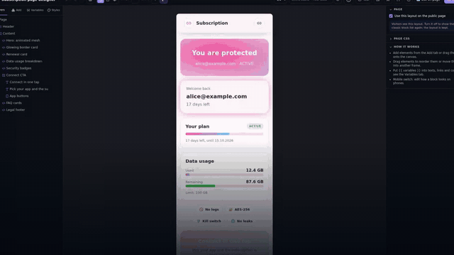
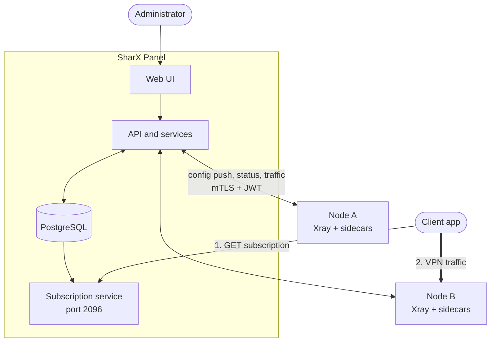
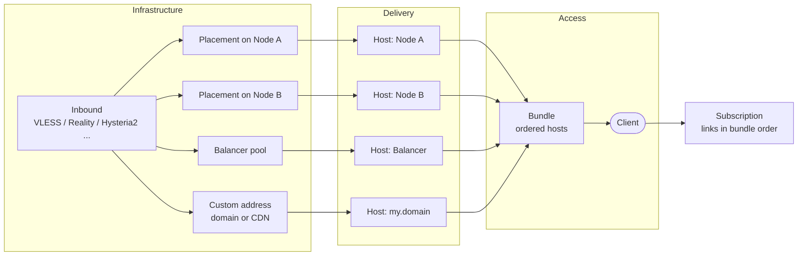
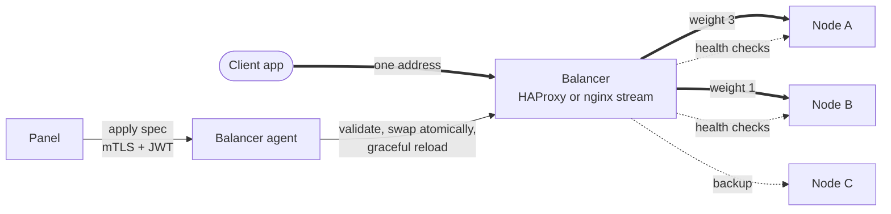
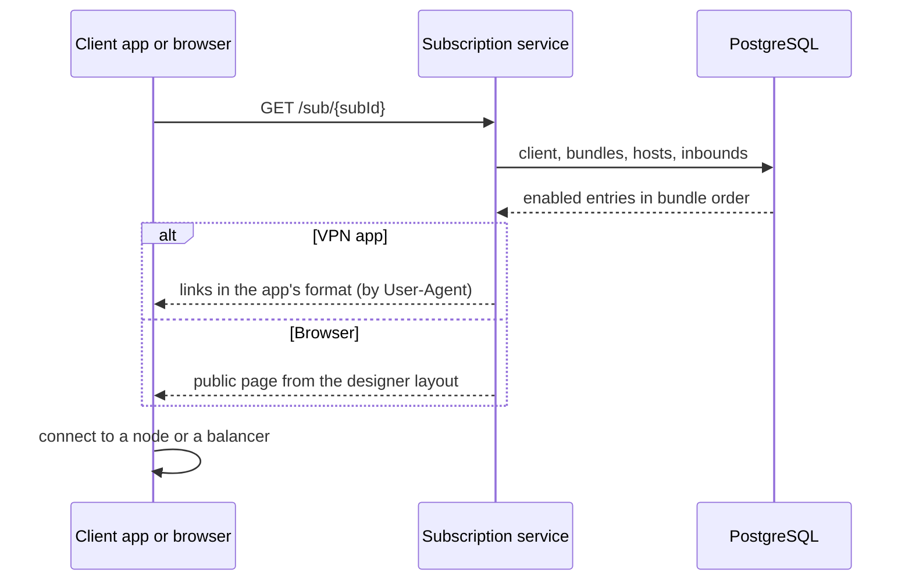
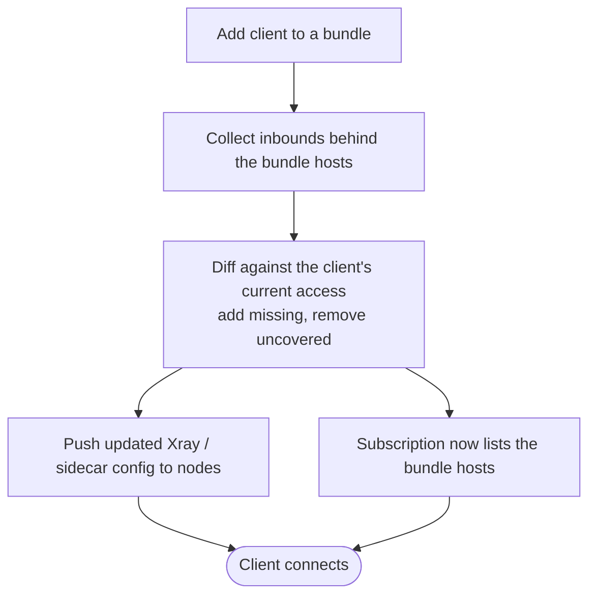

<div align="center">

<!-- SharX Hero Section -->


</div>

<div align="center">

[English](README_EN.md) | [Русский](README_RU.md) | [فارسی](README_FA.md)

</div>

## Welcome to SharX / Добро пожаловать в SharX

**SharX** is a modern multi-node Xray management platform with Docker-first deployment, observability hooks, and a visual subscription page builder.

**SharX** — современная multi-node платформа управления Xray с Docker-сборкой, наблюдаемостью и визуальным конструктором страницы подписки.

This version brings a modern, Docker-first architecture, **multi-node** workers, a **visual subscription page builder**, **encrypted cookie-based web sessions**, and **optional observability** hooks (Prometheus text metrics, optional Loki / VictoriaMetrics in settings, Grafana dashboard JSON export).

Эта версия даёт современную Docker-сборку, **multi-node** worker-узлы, **визуальный конструктор страницы подписки**, **веб-сессии в зашифрованных cookie** и **опциональную наблюдаемость** (метрики в формате Prometheus, опционально Loki/VictoriaMetrics в настройках, JSON дашборда для Grafana).

## Demo / Демо



Полная версия видео: [смотреть демо](./assets/panel-demo.mp4)

<sub>Music: "Inspired" by Kevin MacLeod (incompetech.com), licensed under [CC BY 4.0](https://creativecommons.org/licenses/by/4.0/).</sub>

## How it works / Как это работает

SharX separates **infrastructure** (servers), **delivery** (what a client is shown) and **access** (what a client may use). Everything below is how those pieces connect.

SharX разделяет **инфраструктуру** (серверы), **выдачу** (что видит клиент) и **доступ** (чем клиент может пользоваться). Ниже показано, как эти части связаны. Подробное описание с теми же схемами – в [README_RU.md](README_RU.md).

### 1. Big picture

The panel keeps all data in PostgreSQL, pushes configuration to your **nodes** and serves **subscriptions**. Nodes run Xray and optional sidecars (Telemt MTProto, AmneziaWG, WireGuard). Client apps fetch a subscription from the panel, then connect straight to a node (or to a balancer).



### 2. From inbound to client: placements, hosts, bundles

Three ideas keep the model simple:

- **Placement** – an *inbound* running on a node (or in a balancer pool). This is infrastructure.
- **Host** – one entry a client is shown: an address and port bound to exactly one inbound (a node, a balancer, or your own domain/CDN), with optional link overrides such as SNI, path, name suffix.
- **Bundle** – an ordered set of hosts. A client belongs to bundles; the client's access is the union of the inbounds behind the bundle hosts, and the subscription lists those hosts in order.

Hosts for nodes and balancer pools are created and kept in sync automatically. Add an inbound to a new node and every bundle that already covers that inbound gets the new entry.



### 3. Balancers

A **balancer** is a separate server in front of several nodes. It runs HAProxy or nginx `stream` and relays raw TCP/UDP, so Reality, VLESS, Trojan, Shadowsocks, Hysteria2 and WireGuard keep working unchanged. Clients see one stable address, a dead node is skipped automatically, and node IPs stay hidden.

A **pool** is one inbound behind one balancer. Members default to every node that serves the inbound, with weights, backup flags and an algorithm (round robin, least connections, source-IP hash). For each pool you choose what the client sees:

| Pool mode | Client subscription |
|---|---|
| `replace` | only the balancer entry, node IPs hidden |
| `prepend` | balancer first, direct nodes as fallback |
| `append` | direct nodes first, balancer last |



### 4. What happens when a client opens a subscription

The subscription service resolves the client by its `subId`, walks the client's enabled bundles and hosts, skips disabled or unsupported entries, and builds links in the format the app understands (Happ, v2rayNG, Clash, sing-box and others, chosen by User-Agent). A browser gets the public subscription page instead, rendered from the layout you built in the visual designer.



### 5. Adding a client to a bundle

Assign a client to a bundle and the panel derives the access, provisions the client on every node of the affected inbounds and updates the subscription. Nothing is deleted and re-created, so existing keys and links keep working.



More detail: [bundles](docs/architecture/bundles.md), [balancer](docs/architecture/balancer.md), [wiki](docs/wiki/en/README.md).

## Quick Start / Быстрый старт

### 🚀 Install / Установка 

Клонируйте и запустите:

```bash
git clone https://github.com/konstpic/SharX.git
cd SharX
sudo bash ./install_ru.sh
```

---

<details>
<summary><b>📜 Script Installation (Recommended) / Установка через скрипт (Рекомендуется)</b></summary>

### Automatic Installation / Автоматическая установка

The install script supports multiple Linux distributions and automatically:
- Installs Docker and Docker Compose
- Configures network mode (host/bridge)
- Sets up SSL certificates (Let's Encrypt for domain or IP)
- Generates secure database password
- Creates and starts all services

Скрипт установки поддерживает множество дистрибутивов Linux и автоматически:
- Устанавливает Docker и Docker Compose
- Настраивает режим сети (host/bridge)
- Настраивает SSL сертификаты (Let's Encrypt для домена или IP)
- Генерирует безопасный пароль базы данных
- Создаёт и запускает все сервисы

#### Supported Systems / Поддерживаемые системы

| Distribution | Package Manager |
|--------------|-----------------|
| Ubuntu/Debian | apt |
| Fedora | dnf |
| CentOS/RHEL | yum |
| Arch Linux | pacman |
| Alpine | apk |
| openSUSE | zypper |

#### Panel Installation / Установка панели

```bash
sudo ./install.sh
# Select: 1) Install Panel
```

```bash
sudo ./install_ru.sh
# Выбрать: 1) Установить панель
```

#### Management Menu / Меню управления

After installation, run the script again to access the management menu:

После установки запустите скрипт снова для доступа к меню управления:

```bash
sudo ./install.sh
```

**Menu options / Опции меню:**
- Update Panel / Обновить панель
- Start/Stop/Restart services
- Change ports
- Renew SSL certificates
- View logs and status

**Panel updates / Обновление панели:** **Watchtower** in the same stack + `XUI_DOCKER_UPDATER_*` (in-UI update), or `docker compose pull` + `up -d`, or the SharX script **Update Panel** (pulls `sharx` + `watchtower`). / **Watchtower** в стеке и UI, либо `docker compose pull`, либо **2)** в `install_*.sh`. Set `WATCHTOWER_HTTP_API_TOKEN` in production. / `WATCHTOWER_HTTP_API_TOKEN` в `.env` для production. If you used `build:` in compose, the image name (e.g. `sharx-code-sharx`) is not pullable; use a Harbor `image:` and `docker login` — see README_RU/EN.

**Remote nodes / Удалённые узлы:** enable **multi-node**, **add node** and copy **`docker-compose.yml`** from the modal (`PANEL_URL` + `SECRET_KEY` pairing), then on the worker `docker compose up -d --build`. Manage in **Nodes** / **Geography**. Install script only deploys the panel. / Включите **multi-node**, в **Нодах** скопируйте compose из модалки, на узле — `docker compose up -d --build`. Подробно: [node/README.md](node/README.md).

</details>

---

<details>
<summary><b>🔧 Manual Installation / Ручная установка</b></summary>

### Panel Installation / Установка панели

1. **Clone the repository / Клонируйте репозиторий:**
   ```bash
   git clone https://github.com/konstpic/SharX.git
   cd SharX
   ```

2. **Configure `docker-compose.yml` / Настройте `docker-compose.yml`:**
   - Change `change_this_password` to a secure password
   - Измените `change_this_password` на надёжный пароль
   ```yaml
   XUI_DB_PASSWORD: your_secure_password
   POSTGRES_PASSWORD: your_secure_password
   ```

3. **Prepare SSL certificates / Подготовьте SSL сертификаты:**
   ```bash
   mkdir -p cert
   cp /path/to/fullchain.pem cert/fullchain.pem
   cp /path/to/privkey.pem cert/privkey.pem
   ```

4. **Start services / Запустите сервисы:**
   ```bash
   docker compose up -d
   ```

5. **Access the panel / Откройте панель:**
   ```
   http://your-server-ip:2053
   ```

6. **Configure TLS in panel settings / Настройте TLS в панели:**
   - Certificate: `/app/cert/fullchain.pem`
   - Private Key: `/app/cert/privkey.pem`

7. **Remote nodes (optional) / Удалённые узлы (по желанию):** multi-node + compose from the **add node** modal; see [node/README.md](node/README.md). / Multi-node и docker-compose из модалки добавления узла — [node/README.md](node/README.md).

</details>

---

## Key Features / Основные возможности

- **Multi-node**: One panel controls many worker nodes (REST node API, geography / host overrides)
- **PostgreSQL**: Primary database with in-repo migrations; optional **SQLite → PostgreSQL** import for legacy panel backups
- **Encrypted cookie sessions**: Standard stack uses signed/encrypted browser cookies (Gin session store)
- **Observability (optional)**: `GET {basePath}panel/metrics` (Prometheus text); optional Loki log push and VictoriaMetrics URL in panel settings; downloadable Grafana dashboard JSON for **your** stack (Grafana itself is not bundled by default)
- **Docker + Watchtower**: Pre-built images; in-stack or manual updates
- **Subscription page builder**: Block-based public subscription page (`/panel/api/public/subscription`) — see below
- **Xray core config profiles**: Reusable core JSON merged into worker configs in multi-node mode
- **Telemt (MTProto)**: Sidecars on panel (standalone) and workers (multi-node), separate lifecycle from Xray where applicable
- **HWID (beta)**: Per-client device limits (Happ, V2RayTun)
- **Auto SSL**: Let's Encrypt via install scripts / acme workflow
- **Environment-based config**: Panel, sub, and DB settings via env (see full docs)

- **Multi-node**: одна панель и множество worker-узлов (REST API узла, география / host overrides)
- **PostgreSQL**: основная БД и миграции в репозитории; опциональный **импорт SQLite → PostgreSQL** со старых бэкапов панели
- **Сессии в cookie**: веб-сессии в подписанных/зашифрованных cookie (Gin session store)
- **Наблюдаемость (опционально)**: `GET {basePath}panel/metrics` (текст Prometheus); опционально Loki и VictoriaMetrics в настройках панели; JSON дашборда для импорта в **ваш** Grafana (сам Grafana по умолчанию не входит в compose)
- **Docker + Watchtower**: готовые образы; обновления из стека или вручную
- **Конструктор страницы подписки**: блоковая публичная страница (`/panel/api/public/subscription`) — см. ниже
- **Профили конфига Xray (core)**: общий core JSON, мердж в конфиг worker в multi-node
- **Telemt (MTProto)**: sidecar на панели (single-node) и на worker; жизненный цикл отделён от Xray где задумано
- **HWID (бета)**: лимит устройств на клиента (Happ, V2RayTun)
- **Авто SSL**: Let's Encrypt через скрипты установки / acme
- **Конфиг через env**: панель, подписка, БД — см. полные README_EN/RU

## Supported Protocols / Поддерживаемые протоколы

- **VMESS**
- **VLESS**
- **Trojan**
- **Shadowsocks**
- **Hysteria / Hysteria2**
- **Mixed (SOCKS/HTTP)**
- **WireGuard**
- **HTTP/Tunnel (for specific transport and routing scenarios)**
- **Telemt (MTProto sidecar integration for Telegram proxy flows)**

## Subscription Page Builder / Конструктор страницы подписки

SharX includes a built-in visual constructor for the public subscription page (`/panel/api/public/subscription`) with block-based layout and per-brand customization.

В SharX есть встроенный визуальный конструктор публичной страницы подписки (`/panel/api/public/subscription`) с блочной структурой и кастомизацией под бренд.

**What you can configure / Что можно настраивать:**
- Branding and theme (title, logo, colors, locale)
- Installation guides and app catalog (including Telegram MTProto flow when enabled)
- Add-to-app buttons and deep links
- Response rules (headers, profile metadata, announce/support links)
- Custom HTML/content blocks and ordering
- JSON templates and preview before publishing

## Documentation / Документация

For detailed installation instructions, configuration, and migration guide, please see:

Для подробных инструкций по установке, настройке и миграции, пожалуйста, смотрите:

- **[Full English Documentation](README_EN.md)** - Complete guide in English
- **[Полная русская документация](README_RU.md)** - Полное руководство на русском языке
- **[API Documentation](docs/API.md)** - REST API reference / Справочник REST API

## Requirements / Требования

- Linux server (Ubuntu, Debian, CentOS, Fedora, Arch, Alpine, openSUSE)
- Root access
- Domain name (optional, for TLS with domain)
- Port 80 open (for SSL certificate issuance)

- Linux сервер (Ubuntu, Debian, CentOS, Fedora, Arch, Alpine, openSUSE)
- Root доступ
- Доменное имя (опционально, для TLS с доменом)
- Открытый порт 80 (для выпуска SSL сертификата)

## Support / Поддержка

For issues, questions, or contributions, please refer to the project repository.

По вопросам, проблемам или вкладу в проект обращайтесь в репозиторий проекта.

## Authors / Авторы

**Project Author / Автор проекта:**
- [@konspic](https://github.com/konstpic)

## Donate / Донаты 💵

Support SharX development — card, crypto, and other payment methods:

Поддержите развитие SharX — карта, криптовалюта и другие способы оплаты:

- **[donate.konstpic.ru](https://donate.konstpic.ru/)**

---

**Note**: This version uses Docker containers for easy deployment. All images are pre-built and ready to use.

**Примечание**: Эта версия использует Docker-контейнеры для легкого развертывания. Все образы предварительно собраны и готовы к использованию.

<div align="center">

<!-- SharX Footer Section -->


</div>
